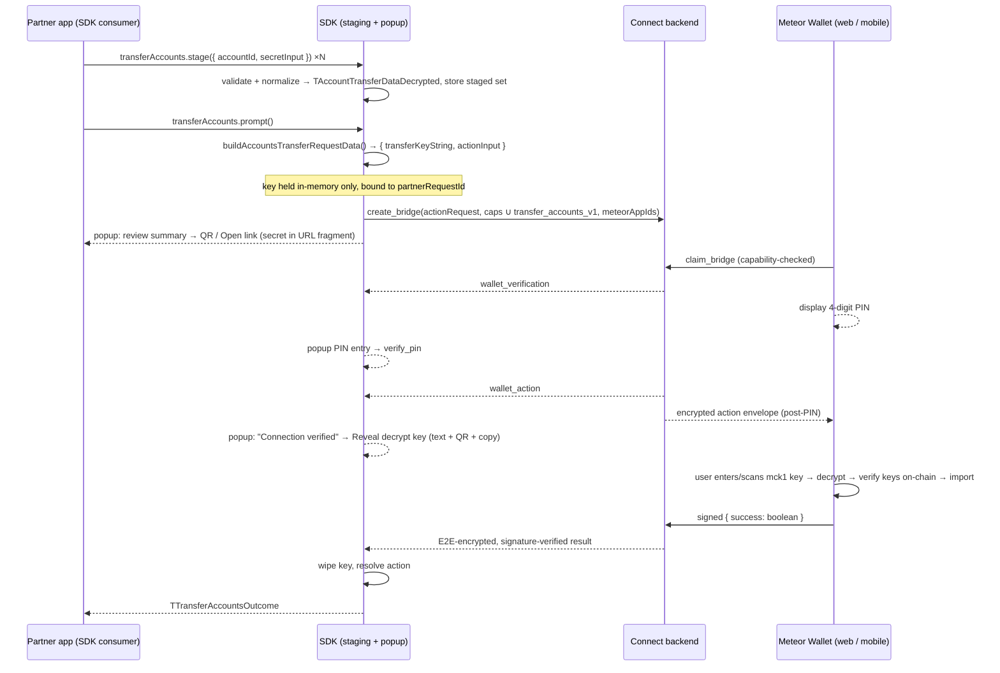

# SDK Plan — Transfer Accounts via Meteor Connect

**Status:** Proposed implementation plan
**Repository:** `meteor_wallet_sdk` — `packages/meteor-sdk-v1/src/MeteorConnect`
**Protocol source of truth:** `@meteorwallet/connect` / `@meteorwallet/connect-shared` **0.8.0** (already installed) and the completed backend implementation in `mc_backend` (the repo checked out at `../meteor-connect-bridge`; `PLAN-account-transfer.md` — phases 1–5b done, audited)
**Reference implementations:** `mc_backend/packages/demo-partner-web` (partner side — the flow we are productizing), `meteor_wallet/web/packages/meteor-frontend` (the first real receiving wallet), `mc_backend/packages/demo-wallet-web` + `demo-wallet-expo` (receiver references)
**Prepared:** 2026-08-04 · **Updated:** 2026-08-06 for 0.8.0 (real web app ids + shared secret encoder — both former §14.2 asks — landed upstream)

---

## 1. Objective and scope

Give partner wallet applications a production SDK flow to transfer their users' accounts into Meteor Wallet:

1. **Import/stage** accounts (account ID + mnemonic or private key) into the SDK with validation and normalization.
2. **Store** the staged set so the partner app can build up / review the list before transferring.
3. **Transfer** the accounts through the Meteor Connect bridge backend in a dedicated popup UI that follows the proven `demo-partner-web` flow: encrypt locally → create bridge → QR / open link → PIN verification → reveal decrypt key → signed `{ success }` result.

Receiving wallets, in order: **Meteor Wallet web** (`meteor-frontend`, live now), then **Meteor Mobile** (developed in the `meteor-v2-apps-windows` repo), which already receives regular Meteor Connect actions from this SDK via QR/deep link — the transfer receiver pattern for it is proven in `demo-wallet-expo`.

Out of scope here: any backend or shared-package changes (the protocol is complete and audited in `mc_backend`), and wallet-side receiving code (already implemented in `meteor-frontend`).

---

## 2. Protocol facts this plan builds on (verified against 0.8.0 sources)

These are settled decisions from `mc_backend/PLAN-account-transfer.md` (D1–D9) and the shipped 0.8.0 packages — the SDK must consume them, not re-implement them:

### 2.1 Action contract

- Domain `"meteor_wallet_core"`, action id `"transfer_accounts"` — `act_impl_meteor_wallet_core` (child of root `"meteor_connect"`).
- Input = `vAllAccountsTransferDataEncrypted`:
  ```ts
  {
    formatVersion: 1,
    allAccountsBasicInfo: Array<{ blockchainId: "near"; networkId: "mainnet" | "testnet"; accountId: string }>, // 1..50, no dupes — plaintext "unverified" preview
    encryptedData: { nonce: string; ciphertext: string }, // AES-256-GCM, 12-byte nonce, ciphertext ≤ 350k base64 chars
  }
  ```
- Output = `{ success: boolean }`. **Wallet-authored and unverifiable — a `success: true` must never trigger destructive source-side behavior (e.g. deleting the partner's accounts).**
- All bounds are exported constants (`TRANSFER_ACCOUNTS_MAX_ACCOUNTS = 50`, `TRANSFER_ACCOUNTS_MAX_SECRETS_PER_ACCOUNT = 10`, `TRANSFER_ACCOUNTS_ACCOUNT_ID_PATTERN = /^[a-z0-9._-]+$/`, etc.) — import them, never re-declare.

### 2.2 Crypto profile and the transfer key

- `buildAccountsTransferRequestData({ decrypted })` (connect-shared) does everything: validates the decrypted payload, generates a fresh random AES-256-GCM key, encrypts, and derives `allAccountsBasicInfo` by explicit allowlist. Returns `{ transferKeyString, actionInput }`.
- Key string format: `` `mck1.<43 chars base64url-nopad of 32 key bytes>.<6-char checksum>` `` (`TMeteorConnectKeyString`). Display grouped in 4s; QR content is the raw key string verbatim; wallet-side import strips all whitespace and returns typed failure reasons (never throws).
- **The key must never travel on the bridge, be persisted, be logged, or enter any serializable store.** In `demo-partner-web` it lives only in React `useState` correlated to `partnerRequestId`; `mc_backend` enforces this with a CI script (`scripts/check-key-confinement.ts`) pinning the exact files allowed to mention `transferKeyString`. The SDK adopts the same discipline (§7).

### 2.3 Server-side action policy (automatic — the SDK must align with it, not implement it)

`transfer_accounts` policy: `{ requiresFreshPinVerification: true, requiredWalletCapabilities: [transfer_accounts_v1], delivery: "post_pin_wallet_encrypted" }`. Consequences:

- **Every transfer bridge passes through the PIN stage** (`wallet_verification`) — the trusted-pairing fast path is denied server-side. Our popup will always show PIN entry.
- The action request is **not** in the claim response; it is delivered to the wallet post-PIN as a claimant-encrypted envelope, only while status is `wallet_action`.
- The server **unions** `getServerRequiredWalletCapabilities()` into whatever the partner sends before idempotency-hashing — but the SDK should still send `[...REQUIRED_METEOR_WALLET_CAPABILITIES, transfer_accounts_v1]` explicitly so wallet filtering and `wallet_update_required` failures are accurate.
- `create_bridge` can fail with `invalid_action_request` (400k canonical-JSON cap / schema failure) and `idempotency_conflict` — both need handling.
- `partnerRequestId` must be ≥16 chars and **unguessable** (CSPRNG) — it is a DO-addressing input.

### 2.4 The first receiving wallet (meteor-frontend) — realities to tolerate

- Claims via URL only: `https://<wallet-origin>/bridge_request?bridgeId=<id>#partnerSecret=<secret>` (secret in the **fragment**). **No QR scanner, no push support** — the partner popup must present a scannable QR of that URL and/or an open-link button.
- Real web app ids exist as of 0.8.0: `EMeteorAppId.meteor_wallet_web` / `meteor_wallet_web_dev`, with backend wallet links registered (`https://wallet.meteorwallet.app/bridge_request?bridgeId=…&protocolVersion=…` and `wallet-dev.meteorwallet.app` respectively; `EBridgeLinkType.web_app_url`). **But meteor-frontend still identifies as `EMeteorAppId.meteor_bridge_test_web`** — it has not migrated to the new id yet. So the SDK's transfer `meteorAppIds` must include `meteor_bridge_test_web` *alongside* the real web ids until that migration lands (the demo partner now sends all three: `[meteor_bridge_test_web, meteor_wallet_web_dev, meteor_wallet_web]`), after which the test id is dropped from the default.
- Advertises `transfer_accounts_v1`; key entry is a plain input (paste/type); decrypt → on-chain FullAccess access-key verification per secret → import.
- **Never sends a failure result** (`errorResult` unused; no decline button). User rejection, decrypt failure, verification failure, and import failure all look like *silence* to the partner — the failure path is bridge expiry. (The demo wallet, by contrast, declines with `{ success: false }`.)
- Import is **non-atomic** (`Promise.all`, no rollback): a retry after partial failure can hit "already in this Meteor wallet". The SDK flow must therefore be idempotent-friendly and never assume all-or-nothing on the wallet side.

---

## 3. Current SDK state and gap summary

The SDK has **zero** transfer code today. The registry is NEAR-only (`TMCActionDomainId = "near"`), mobile-bridge request/result adapters are hard-coded to `act_impl_near`, capabilities sent to `create_bridge` are the hard-coded base set, and the popup has one container (`meteor-action-ui-container`) with the sign-in/wallet-picker layout. Exact touch points are listed in §8.

What we reuse as-is:

- `PartnerBridgeClient` (0.8.0) — `create_bridge` / `verify_pin` / `cancel_bridge` already accept per-action capabilities; no transfer-specific client APIs exist or are needed.
- `MobileBridgeSession` — its phase machine (`creating_bridge → waiting_for_wallet → wallet_verification → wallet_action → completed|failed|cancelled`) is exactly the transfer lifecycle; `wallet_action` is the authoritative reveal gate.
- `meteor-mobile-bridge-panel` — the QR/countdown/PIN/status UI binds only to `IMobileBridgeSnapshot` and is action-agnostic.
- `MeteorActionUiOverlay` — the 415×556 popup shell is fully action-agnostic (slot-based).

### 3.1 Utility inventory — package-provided vs. new SDK code

Everything protocol- and crypto-level already ships in the installed packages (verified importable from this repo's `@meteorwallet/connect-shared` 0.8.0). **The SDK must import these, never re-implement them:**

| Concern | Provided by packages — use directly |
|---|---|
| Encrypt + key generation + preview derivation | `buildAccountsTransferRequestData({ decrypted })` — the entire partner-side crypto step in one call |
| Raw secret input → `TAccountSecretData` encoding | `buildAccountSecretData({ secretInput, derivationPath? })` (new in 0.8.0) — auto-detects `ed25519:` private key vs 12/24-word mnemonic, whitespace-normalizes, applies `NEAR_DEFAULT_DERIVATION_PATH` default, builds the `utf8_base64::`/`near_prefixed_utf8_base64::` encodings, schema-validates. Returns typed failures (`TBuildAccountSecretDataResult`): `empty_secret_input` / `invalid_private_key` / `invalid_mnemonic_word_count` (+`wordCount`) / `invalid_secret_data` (+`issueMessage`) — the SDK maps these to friendly copy, never re-implements detection |
| Decrypt + validate (tests / round-trip verification) | `decryptAccountsTransferRequestData`, `TAccountsTransferDecryptResult` |
| Action serialization / result hydration | `act_impl_meteor_wallet_core.action.transfer_accounts.request(...).toJsonObject()` / `act_impl_meteor_wallet_core.hydrateResultPayload(...)` |
| Payload schemas + every bound | `vAllAccountsTransferDataEncrypted`, `vAllAccountsTransferDataDecrypted`, `vAccountTransferDataDecrypted`, `vAccountSecretData` (+ mnemonic/private-key variants), `vAccountBasicData`, and all `TRANSFER_ACCOUNTS_*` constants |
| Key string format + parsing | `METEOR_CONNECT_KEY_PREFIX`, `TMeteorConnectKeyString`; `importPortableAesGcmKeyFromString` (wallet-side parse — the SDK never needs to parse a key it generated) |
| Capability / policy logic | `EWalletProtocolCapability.transfer_accounts_v1`, `REQUIRED_METEOR_WALLET_CAPABILITIES`, `getServerRequiredWalletCapabilities`, `getActionPolicy`, `hasRequiredWalletCapabilities`, `METEOR_WALLET_PROTOCOL_VERSION` |
| Bridge transport, PIN, per-action caps, result signature verification | `PartnerBridgeClient` + `PartnerBridgeStore` (already wrapped by `MobileBridgeSession`), incl. `IPartnerBridgeInfo.partnerRequestId` for the reveal gate |
| Base64/bytes helpers | `bytesToBase64` / `base64ToBytes` from `@nice-code/util` (not re-exported by connect-shared — import directly, as the demos do) |

What does **not** exist in the packages (demo-local code in `mc_backend`, to be written as SDK code mirroring the demos):

| Concern | Reference | Size |
|---|---|---|
| Key display grouping (groups of 4) | `RevealDecryptionKeyCard.tsx` (`groupKeyForDisplay`) | 1 line |
| Key QR rendering | demo uses `qrcode`; SDK already bundles `qr-code-styling` | existing dep |
| Staging storage, popup UI, `TransferKeyHandle` lifecycle, registry/adapter plumbing | this plan §5–§9 | the actual SDK work |

Bounds enforcement at staging time (§5.1) is done by running the shared schemas (`v.safeParse(vAccountTransferDataDecrypted, …)` per account, `vAllAccountsTransferDataDecrypted` for the set) — the SDK adds friendlier per-field error messages on top, not its own limit constants.

---

## 4. End-to-end flow



---

## 5. Public SDK API

### 5.1 Staging (import) API

New methods on `MeteorConnect` (implementation in a new `MeteorConnect/transfer_accounts/` module):

The API speaks the shared schema's vocabulary directly — same field names (`blockchainId`/`networkId`/`accountId`), same account identity tuple, and the same one-account-many-secrets structure as `vAccountTransferDataDecrypted`:

```ts
import type {
  TAccountBasicData,            // { blockchainId; networkId; accountId } — the account identity tuple
  TAccountTransferDataDecrypted, // TAccountBasicData & { secret: TAccountSecretData[] } (1..10, deduped)
  TBlockchainId,                 // "near"
  TCryptoGenericNetworkId,       // "mainnet" | "testnet"
} from "@meteorwallet/connect-shared";

// Raw partner input — the SDK owns parsing + encoding into TAccountSecretData
interface IStageTransferAccountInput {
  /** Optional — defaults to "near", the only blockchainId in transfer v1. */
  blockchainId?: TBlockchainId;
  networkId: TCryptoGenericNetworkId;
  /** Trimmed + lowercased, then validated by vAccountBasicData (2..64, NEAR account grammar). */
  accountId: string;
  /** Mnemonic phrase (12/24 words) OR "ed25519:<base58>" private key. */
  secretInput: string;
  /** Mnemonic secrets only. Passed through to buildAccountSecretData; defaults to the shared NEAR_DEFAULT_DERIVATION_PATH ("m/44'/397'/0'"). */
  derivationPath?: string;
}

// Secret-free summary for partner UI listings — identity tuple + what kinds of secrets are staged
type TStagedTransferAccountSummary = TAccountBasicData & {
  secretTypes: Array<"mnemonic" | "private_key">;
};

// Typed reason codes, matching the shared result-shape convention (cf. TAccountsTransferDecryptResult).
// Secret-level reasons are passed through verbatim from the shared encoder's
// TBuildAccountSecretDataResult; account/set-level reasons are SDK-added.
type TStageTransferAccountResult =
  | { ok: true; account: TStagedTransferAccountSummary }  // summary, not secrets — no echoing secrets back out
  | {
      ok: false;
      reason:
        | "invalid_account_id"              // vAccountBasicData failure
        | "empty_secret_input"              // ┐
        | "invalid_private_key"             // │ passed through from
        | "invalid_mnemonic_word_count"     // │ buildAccountSecretData (0.8.0)
        | "invalid_secret_data"             // ┘ schema backstop (over-length secret, bad derivation path)
        | "duplicate_secret"                // canonical-JSON duplicate on the same account (schema check)
        | "too_many_secrets"                // > TRANSFER_ACCOUNTS_MAX_SECRETS_PER_ACCOUNT
        | "too_many_accounts";              // > TRANSFER_ACCOUNTS_MAX_ACCOUNTS
      message: string;
      /** Present for invalid_mnemonic_word_count — from the shared encoder. */
      wordCount?: number;
    };

// All transfer surface lives on one namespace object — the MeteorConnect class gains a single
// property instead of seven methods, and the feature reads as one unit at call sites.
const { transferAccounts } = meteorConnect;

/**
 * Stages a secret for an account. Staging the same (blockchainId, networkId, accountId) tuple
 * again ADDS the secret to that account's `secret` array (schema: 1..10, deduped) — it does not
 * replace the account. Use removeStaged to start an account over.
 */
transferAccounts.stage(input: IStageTransferAccountInput): Promise<TStageTransferAccountResult>;
transferAccounts.getStagedSummaries(): Promise<TStagedTransferAccountSummary[]>; // safe shape for UI listing
transferAccounts.getStagedWithSecrets(): Promise<TAccountTransferDataDecrypted[]>; // hazard is in the name — full shape incl. secrets
transferAccounts.removeStaged(identifier: TAccountBasicData): Promise<void>;
transferAccounts.clearStaged(): Promise<void>;
```

A pure helper `parseTransferSecretInput(secretInput): { type: "mnemonic" | "private_key" } | { type: "invalid"; reason: string }` is exported alongside, so partner UIs can render live "detected: mnemonic" feedback (as the demo's `TransferAccountsCard` does) without staging anything. It is a thin wrapper over `buildAccountSecretData` (inspect `result.secret.type` / failure reason) — no local detection logic.

Validation/encoding rules (matching the 0.8.0 `demo-partner-web` store, which now delegates too):

- **All secret parsing/encoding goes through the shared `buildAccountSecretData`** (§3.1) — the SDK contains zero encoding rules of its own. Its typed failure reasons pass through to `TStageTransferAccountResult`; the SDK only adds friendly `message` copy per reason (as the demo does).
- Account ID: trimmed + lowercased, length 2–64, charset via the shared `TRANSFER_ACCOUNTS_ACCOUNT_ID_PATTERN`, then `vAccountBasicData` — readable `invalid_account_id` messages instead of an opaque valibot failure at build time.
- Staging keys accounts by the schema's identity tuple `(blockchainId, networkId, accountId)`; re-staging the same tuple appends to that account's `secret` array (deduped by canonical JSON, exactly as `vAccountTransferDataDecrypted` enforces). This deliberately differs from the demo store's replace-on-restage (single-secret test harness) — the schema models one account with up to 10 secrets, and the merge semantics expose that properly.
- Bounds are enforced at staging time by validating each encoded entry with the **shared schemas** (`vAccountTransferDataDecrypted`, and the full set with `vAllAccountsTransferDataDecrypted`) so failures happen early with good messages instead of at `create_bridge` — the SDK adds the typed reason codes and friendly copy, not its own limit logic (§3.1).

### 5.2 Transfer flow API

The primary surface is a **one-shot flow method** that resolves to a typed outcome; the raw `ExecutableAction` remains available as an escape hatch:

```ts
const outcome = await meteorConnect.transferAccounts.prompt(options?: {
  /** Override the staged set for this transfer (bypasses staging storage entirely). */
  accounts?: TAccountTransferDataDecrypted[];
});

type TTransferAccountsOutcome =
  | { status: "imported" }   // wallet returned signed { success: true }
  | { status: "declined" }   // wallet returned signed { success: false } (demo-wallet decline path)
  | { status: "cancelled" }  // user closed/cancelled locally before commitment
  | { status: "expired" }    // bridge expired with no signed result (meteor-frontend's only failure signal)
  | { status: "failed"; reason: "pin_attempts_exhausted" | "wallet_update_required" | "bridge_failed" | "connection_failed" };
```

**Contract: flow endings resolve; integration errors throw.** `prompt()` throws only for errors where no popup flow is possible or something is misconfigured (`transfer_accounts_nothing_staged`, `transfer_accounts_invalid_input`, `transfer_accounts_unavailable`, `transfer_accounts_backend_rejected` mapping `invalid_action_request`/`idempotency_conflict`, and result-verification failures like `mobile_bridge_action_result_mismatch`). Every user- or wallet-driven ending resolves, so partner code is one `switch (outcome.status)` instead of `try/catch` around "the user closed the popup".

The mapping is grounded in the session's actual settlement behavior (verified in `MobileBridgeSession`/`ExecutableAction`): the underlying action promise rejects with `"Action was cancelled"` / `"mobile_bridge_cancelled"` → `cancelled`; `"mobile_bridge_expired"` → `expired`; `"PIN attempts exceeded"` → `failed/pin_attempts_exhausted`; `"wallet_update_required"` → `failed/wallet_update_required`; other bridge failures → `failed/bridge_failed`. Wire output maps `{ success: true } → imported`, `{ success: false } → declined`. The **registry output stays wire-shaped `{ success: boolean }`** — outcome mapping lives entirely in the wrapper, so `ExecutableAction`/adapter semantics stay uniform with every other action.

Escape hatch for advanced integrations (custom lifecycle control):

```ts
const action = await meteorConnect.transferAccounts.createAction(options?);
// ExecutableAction with output { success: boolean }; rejects on cancel/expiry like every other action
```

Internals of `createAction` (`prompt()` = `createAction()` + `promptForExecution()` + outcome mapping):

1. Load staged accounts (or use `options.accounts`); throw `transfer_accounts_nothing_staged` if empty.
2. Retain a frozen **decrypted snapshot** of the account set for the action's lifetime — required for per-bridge payload regeneration (§7).
3. `buildAccountsTransferRequestData({ decrypted: { formatVersion: 1, accounts } })` for the initial build; create the registry action with **only** the encrypted input: `{ id: "meteor_wallet_core::transfer_accounts", input: built.actionInput }`.
4. Attach the **sensitive transfer attachment** (§7) to the `ExecutableAction` — the decrypted snapshot + per-session key handles — outside `request`/`expandedInput`, non-enumerable, non-serializable.
5. Force the standard popup: transfer rejects `strategy: "target_element"` (the reveal card must not be mountable into an arbitrary partner DOM subtree; the popup path also owns the committed-close confirm plumbing).
6. On `{ success: true }`, optionally clear the staged set (config flag, default **true** — the transfer's purpose is fulfilled; the partner app still holds its own copies). The decrypted snapshot is dropped on every terminal outcome and on disposal regardless.

### 5.3 Exports

`src/index.ts` re-exports the input/outcome types, `TStagedTransferAccountSummary`, and `parseTransferSecretInput`. It must **not** export `TransferKeyHandle`, the sensitive attachment, or anything carrying `transferKeyString`.

---

## 6. Staged-account storage

**Decision needed (recommendation included).** Staged accounts contain plaintext secrets. `demo-partner-web` persists them in plaintext localStorage deliberately (testnet harness); a production SDK should not silently do that.

Recommended design:

- **Default: in-memory staging only.** The staged set lives in the `MeteorConnect` instance; a page reload loses it. This is safe-by-default and matches how a real partner wallet would use the flow (stage → transfer in one session, sourced from its own secure storage).
- **Opt-in persistence** via config: `transferAccounts: { persistStagedAccounts: true }` on `IMeteorConnect_Initialize_Input` — stores under a new typed-storage key `stagedTransferAccounts` on `IMeteorConnectTypedStorage` (prefix `met_data_`, NOT the `met_bridge_partner::` namespace, which is wiped wholesale by identity reset). On load, re-validate with `v.safeParse(v.array(vAccountTransferDataDecrypted))` and drop on failure — same defensive pattern as the demo store.
- Document plainly (readme + jsdoc): persisted staging is plaintext-at-rest in the partner origin's storage; recommended only for development/testnet integration. The staged set is cleared by `transferAccounts.clearStaged()` and (by default) after a successful transfer; the in-memory set is also dropped on `MeteorConnect.dispose()`.

The typed-storage helper (`meteorConnect.storage`, `createTypedStorageHelper`) already gives us get/set/remove — no new storage machinery needed.

---

## 7. Transfer key lifecycle and confinement

The single most security-sensitive element. Rules (all enforced structurally, then tested):

1. `TransferKeyHandle` is a tiny class holding `transferKeyString` in a private field, **bound to exactly one `MobileBridgeSession` instance** (the one whose `create_bridge` carried its ciphertext); `toJSON()` and `toString()`/inspect return `"[REDACTED]"`. It exposes exactly two methods:
   - `getRevealPayload(session: MobileBridgeSession): { grouped: string; raw: string } | null` — non-null **only** while `session` is the bound instance **and** its snapshot phase is `"wallet_action"` **and** the handle is unwiped. Instance binding is the SDK-native equivalent of `demo-partner-web`'s `partnerRequestId` correlation (`App_Partner.tsx:383-393`, audit finding #9) — the demo needed the id because React state and mutations interleave; here the SDK owns both sides, and `partnerRequestId` is a private field of the session anyway. A key generated for one bridge can never meet another bridge's `wallet_action`, by construction.
   - `wipe(): void` — idempotent; clears the string field.
2. Wipe triggers (mirroring the demo's `useEffect`/clear points): terminal phases (`completed` / `failed` / `cancelled`), `cancelAction()`, `refreshMobileBridge()`, `resetMobileIdentityAndRePair()`, popup close, session disposal, `ExecutableAction` disposal, `MeteorConnect.dispose()`, and `create_bridge`/push failure. The retained decrypted snapshot (§5.2) is dropped at the same terminal/disposal points.
3. **Per-bridge regeneration mechanics** (new key, nonce, and ciphertext for every bridge — never rebind an old key to a new bridge): `refreshRequest()` cancels the old session and calls `prepareRequest()` fresh, but the request adapter only receives `expandedInput`, which holds the *initial* ciphertext. So `ExecutableAction.prepareMobileBridge()`/`refreshMobileBridge()` thread the **sensitive transfer attachment** into `prepareRequest`/`refreshRequest`, and the transfer branch of the adapter calls `attachment.buildFreshBridgePayload()` — which re-runs `buildAccountsTransferRequestData` on the retained decrypted snapshot, wipes the previous handle, creates a new `TransferKeyHandle` bound to the new session, and returns the fresh `actionInput` for the wire `actionRequest`. `expandedInput` keeps the initial build (typing/registry consistency); the per-bridge `prepared.actionRequest` is authoritative, and result matching already compares against exactly that (`serialized.domain/id` vs `prepared.actionRequest`).
4. The key never enters: the action `request`/`expandedInput`, `MobileBridgeSession` snapshots, typed storage, bridge storage, lease records, logger calls, thrown errors, Lit reactive properties before the reveal gate, or any URL/QR except the dedicated key QR rendered post-reveal.
5. **Key-confinement check:** port `mc_backend/scripts/check-key-confinement.ts` — a repo script that pins the exact SDK files allowed to reference `transferKeyString`/`TransferKeyHandle` internals (expected: the transfer module, the reveal-card element, and their tests) and greps for forbidden patterns (`console.*`, storage APIs). Wire into `bun run lint`/CI.
6. Canary test: create a transfer action with a distinctive key, then assert its absence from `JSON.stringify(request)`, every mocked bridge call body, the deep link, the bridge QR payload, snapshots, storage contents, and the DOM before reveal (see §12).

Related logging hygiene (not a key leak, but worth fixing in the same pass): `MeteorConnect.createAction` logs the full `expandedInput` via `jsonStringifyCompat` — for transfer that would dump the account list plus up to 350k chars of ciphertext to the console. Special-case the transfer id to log a summary (`accounts: N, ciphertext: N bytes`) instead.

---

## 8. Bridge integration changes (file-level)

### 8.1 Action registry

- `action/mc_action.types.ts` — widen `TMCActionDomainId` to `"near" | "meteor_wallet_core"`.
- New `action/mc_action.meteor_wallet_core.ts`:
  ```ts
  export const MCMeteorWalletCoreActions = {
    "meteor_wallet_core::transfer_accounts": {
      input: {} as TAllAccountsTransferDataEncrypted,
      expandedInput: {} as TAllAccountsTransferDataEncrypted,
      output: {} as { success: boolean },
      meta: { executionTargetSource: "on_execution" },   // meta is mandatory — ExecutableAction reads it unconditionally
    },
  } as const satisfies Record<TMCActionId<"meteor_wallet_core">, IMCActionSchema>;
  ```
- `action/mc_action.combined.ts` — spread `MCMeteorWalletCoreActions` into `MCActionRegistryMap`.
- Audit `ExecutableAction`'s `near::`-prefixed special cases (`:192` sign-in, `:212` sign-out, `:271` local sign-out, `:298-311` post-execute account refresh) — all are id-equality checks, so the new action flows past them safely; add a test proving it.

### 8.2 Execution-target gating

- `MeteorConnectMobileBridgeClient.getExecutionTargetConfigs` (`:225-240`): add `request.id === "meteor_wallet_core::transfer_accounts"` → `[this.connectionShell()]`. (Transfer has no account target; without this, `createAction` throws "No execution clients found".)
- `MeteorConnectV1Client.getExecutionTargetConfigs` (`:81-123`): currently offers `v1_web`/`v1_ext` targets for **any** action id and would fall through in `makeRequest`. Gate to the `near::` domain (`request.id.startsWith("near::")` or a domain check) — this is a correctness fix independent of transfer.
- `MeteorConnectV2MessengerClient`: its execution body is entirely commented out today; no change, but the same domain gate should land when it is revived.
- Result: for a transfer action, `allExecutionTargets` contains exactly `v2_bridge_mobile` → the popup naturally renders in single-target (`contextual`/platform-locked) mode with no wallet picker.

### 8.3 Prepared-action shape + request adapter

- `MeteorConnectMobileBridgeClient.types.ts` — replace the flat NEAR-only `sharedActionId` with a domain-discriminated shape:
  ```ts
  export type TMobileBridgePreparedActionKind =
    | { domain: "near"; sharedActionId: TMobileNearActionId; pendingFunctionCallKey?: KeyPair; retainedMessageState?: string }
    | { domain: "meteor_wallet_core"; sharedActionId: "transfer_accounts" };
  export interface IMobileBridgePreparedAction {
    sdkRequest: ...;
    actionRequest: IActionPayload_Request_JsonObject;
    kind: TMobileBridgePreparedActionKind;
  }
  ```
- Rename/split `nearActionToMobileBridge.ts` → `sdkActionToMobileBridge.ts` dispatching by domain: NEAR cases unchanged; transfer case is one line — `act_impl_meteor_wallet_core.action.transfer_accounts.request(sdkRequest.expandedInput).toJsonObject()`. Keep `normalizeFunctionCallKey` inside the NEAR branch only.

### 8.4 Per-action capabilities and app ids

- `MobileBridgeSession.prepare()` (`:136-166`): compute `requiredWalletCapabilities` as
  `sort(unique([...REQUIRED_METEOR_WALLET_CAPABILITIES, ...getServerRequiredWalletCapabilities({ domain, id })]))` from the prepared action instead of the hard-coded base set. (Server unions anyway; sending it makes wallet-link filtering and failure codes accurate, and keeps idempotency hashes consistent with what the server stores.)
- **App ids per action:** today the session sends `meteorAppIds: [this.input.meteorAppId]` (mobile app). Transfer must target the web wallet now and more apps later. Add to `IMeteorConnectMobileBridgeConfig`:
  ```ts
  transferAccounts?: {
    enabled?: boolean;                       // default false until rollout
    meteorAppIds?: EMeteorAppId[];           // ordered preference; default derived from config.meteorAppId (see below)
  };
  ```
  and plumb per-prepared-action `meteorAppIds` through `IMobileBridgePreparedAction` → `create_bridge`.
  Default derivation (0.8.0 ids exist; meteor-frontend hasn't migrated to them yet — §2.4): when `config.meteorAppId` is the `_dev` mobile id → `[meteor_wallet_web_dev, meteor_bridge_test_web]`, otherwise → `[meteor_wallet_web, meteor_bridge_test_web]`. The real web id leads (its backend link is the canonical wallet URL, so QR/open-link land on the right deploy); `meteor_bridge_test_web` stays in the list solely so meteor-frontend's claims pass app-id filtering until it identifies as `meteor_wallet_web` — drop it from the default then (tracked in §14.2).
- **Wallet-link selection must follow the per-action app ids** — this is a hard-fail trap, not a nicety: `MobileBridgeSession.applyPartnerState()` picks the deep link via `bridge.info.walletLinks.find((l) => l.appId === this.input.meteorAppId)` (the single configured *mobile* app id) and fails the session with `mobile_bridge_app_link_missing` when no link matches. A transfer bridge created for `meteor_bridge_test_web` would die right there. The session input gains `targetMeteorAppIds: EMeteorAppId[]` (ordered preference); link selection takes the first match from that list, and the same list is what `create_bridge`/push receives. NEAR actions pass `[config.meteorAppId]` — behavior unchanged.
- **Push:** structurally unreachable for transfer (no account target ⇒ `selectPushWallet` is never consulted), and meteor-frontend cannot receive push at all. Explicitly assert in `prepareRequest` that the transfer path never calls `selectPushWallet` (test). Push-to-paired-mobile-wallet (still PIN-gated, proven in the demo) is a deliberate **later** enhancement once Meteor Mobile receives transfers (§14).

### 8.5 Wallet links, QR, and open-in-app

- `create_bridge` output `walletLinks` contains per-app links; the current session picks a link and appends `#partnerSecret=` (or `&`) — meteor-frontend parses the secret from the fragment, so the existing append logic is compatible. Verify link selection picks the right entry for web-wallet app ids (https `…/bridge_request?bridgeId=…` links) vs the custom-scheme mobile links, and that the QR encodes the full link with fragment.
- `openCurrentSessionInApp()` currently **throws** `mobile_bridge_native_scheme_not_allowed` for anything but `meteorwallet:`/`meteorwalletdev:` — a web-wallet https link is blocked today. Extend: when the session's selected wallet link belongs to a web-wallet app id, allow exactly that link's https URL (opened via `window.open`/anchor). The check stays an allowlist derived from the backend-issued `walletLinks`, never partner-supplied URLs.

### 8.6 Result path

Split `mobileBridgeResultToSdk.ts` into shared verification + per-domain hydration:

1. Shared (unchanged): `signatureVerified === true`, result-shape guard, `serialized.domain/id === prepared.actionRequest.domain/id`.
2. Hydrate by domain: `act_impl_near` ↔ `act_impl_meteor_wallet_core.hydrateResultPayload(serialized)`; compare recomputed `outputHash`; `!hydrated.result.ok` → throw typed error.
3. **Branch transfer before `requireTargetAccount`** (transfer has no target account — today's code would throw `mobile_bridge_missing_target_account`).
4. Transfer mapping: `{ success: true }` → `{ status: "imported" }`; `{ success: false }` → `{ status: "declined" }` (the demo wallet's decline path — do **not** treat as a thrown error; it is a legitimate user decision). Bridge `failed`/expiry with no result → `{ status: "expired" }` (meteor-frontend's only failure signal — see §2.4); pre-commit cancel → `{ status: "cancelled" }`.

### 8.7 Session/action lifecycle notes

- `ExecutableAction.watchMobileSession()` auto-executes at `wallet_verification`/`wallet_action` — correct for transfer too (execution = awaiting the signed result), no change.
- `MobileBridgeSession.cancel()` already returns `"target_already_committed"` post-commitment; the popup close flow (`ActionUi.confirmCommittedMobileClose`) already warns — reuse, with transfer-specific copy ("the transfer may still complete on the other device; your decrypt key will be discarded from this page").
- Bridge expiry (`expiresAt`) is already surfaced in snapshots; for transfer, expiry after reveal is the *normal* failure path — the UI must present it as "transfer not completed" rather than an error.

---

## 9. Dedicated popup UI

### 9.1 Routing

`ActionUi._renderNormalActionUI` (`ActionUi.ts:169-188`) is the single place that instantiates `MeteorActionUiContainer`. Select the container element by action domain: `meteor_wallet_core::transfer_accounts` → new `<meteor-transfer-accounts-container>`. Everything else about `ActionUi` (singleton one-active-action guard, overlay creation, font injection, close/cancel plumbing, committed-close confirm) is reused unchanged. `MeteorActionUiOverlay` (415×556 shell) is reused verbatim.

### 9.2 Screens (`meteor-transfer-accounts-container`)

Follows `demo-partner-web`'s staged flow, restyled to the design system established in `meteor-mobile-bridge-panel` (same tokens as `meteor-action-button`: primary gradient `62,19,231 → 89,47,254`, radius .65rem, kicker/pill/stage-panel patterns):

1. **Review** (pre-bridge): "Transfer accounts to Meteor Wallet" — account list from `allAccountsBasicInfo` (accountId + `NEAR · <network>` rows; safe summaries only, never secrets), count, and a primary "Start secure transfer" button. Creating the bridge only on explicit click keeps the 5-minute bridge TTL from burning while the user reads.
2. **Connect** (`creating_bridge` → `waiting_for_wallet` → `wallet_verification`): **reuse `<meteor-mobile-bridge-panel>`** for QR (gradient-frame tile), countdown/refresh, deep-link/open button, and the segmented PIN stage — all already built and binding only to `IMobileBridgeSnapshot`. Device-adaptive: QR-primary on desktop; "Open in Meteor Wallet" primary + QR icon-toggle on mobile browsers (existing behavior).
3. **Reveal** (`wallet_action`): the new `<meteor-transfer-key-card>`:
   - "Connection verified" stage header (green pill), warning copy: *"This key unlocks your transferred accounts. Enter it only in Meteor Wallet on the connected device."*
   - Hidden-by-default: the key string is **not in the DOM at all** before the explicit "Reveal decrypt key" click (conditional render, not CSS).
   - After reveal: key grouped in 4s in a monospace tile, **Copy** button (flips to "Copied ✓", warns about clipboard history), **key QR** (via the already-bundled `qr-code-styling`, generated into component state — never via any cache/store), and a **Hide** button that removes both text and QR.
   - The card pulls the key exclusively through `TransferKeyHandle.getRevealPayload(session)` on each render — if the gate condition lapses (reconnect, phase regression), the render returns to hidden automatically.
   - Bridge expiry countdown stays visible; on expiry the card wipes and transitions to the terminal state.
4. **Terminal**: reuse the compact icon stages from the mobile panel — `imported` (green check, "Accounts transferred"), `declined`, `expired` ("The transfer wasn't completed on the other device"), `cancelled`.

Accessibility/privacy details carried over from the prior review work: no key in `aria-live`, tooltips, `<input value>`, or data attributes; reveal/copy/QR are deliberate clicks; reduced-motion respected; popup keyboard-navigable including the sandboxed-iframe Enter handling already solved for the PIN input.

### 9.3 Preview harness

Add transfer scenarios to `preview/action-ui/scenarios.mjs` + entry mocks (staged review, waiting, PIN, reveal-hidden, reveal-shown, each terminal state) so the screens are iterable without a live backend, same as the existing bridge panel previews.

---

## 10. Configuration and rollout gating

- `IMeteorConnectMobileBridgeConfig.transferAccounts.enabled` (default `false`): when off, `transferAccounts.prompt()`/`createAction()` throw `transfer_accounts_unavailable` and no UI/registry behavior changes for existing consumers. This is the SDK-side kill switch; the backend-side lever is the wallet-capability/app-id gate that already exists.
- The staging API works regardless of the flag (it is inert data handling); only the bridge flow is gated.
- Partner metadata requirements (since 0.7.0) already handled in this repo (https-only icon, bounded name/description — `normalizePartnerMetadata`).

---

## 11. Error and cancellation semantics

| Situation | SDK behavior |
|---|---|
| Empty staged set / schema-invalid input | throw `transfer_accounts_invalid_input` pre-bridge; no key generated |
| `create_bridge` → `invalid_action_request` / `idempotency_conflict` | wipe key, throw `transfer_accounts_backend_rejected` with safe reason code |
| Wallet lacks capability (`wallet_update_required` failure code) | key wiped; outcome `failed/wallet_update_required`; panel copy generalized: "Update Meteor Wallet to receive account transfers" |
| Wrong PIN ×3 (`pin_attempts_exceeded`) | existing terminal PIN semantics; key wiped; outcome `failed/pin_attempts_exhausted` |
| User closes popup pre-commitment | `cancel_bridge`, wipe key, outcome `cancelled` |
| User closes popup post-commitment | committed-close confirm; detach locally; wipe key; outcome `expired` unless a result already arrived |
| Bridge expires (incl. after reveal) | wipe key; outcome `expired` — presented as neutral "not completed", because meteor-frontend cannot signal failures |
| Signed `{ success: false }` | outcome `declined` (not an exception) |
| Signed `{ success: true }` | outcome `imported`; optionally clear staged set |
| Result signature/domain/id/hash mismatch | throw `mobile_bridge_action_result_mismatch` (existing error), wipe key |

Never delete or mutate partner source data on any outcome. Retries always regenerate key + ciphertext (§7.3); because the wallet-side import is idempotent per exact account and duplicate-rejecting otherwise, document that a retry after partial wallet-side import may report already-imported accounts as errors on the wallet — this is wallet-side UX debt (§14.2), not SDK-resolvable.

---

## 12. Test plan

**Unit (bun test, alongside existing mobile-bridge tests):**
- Staging: shared-encoder reason pass-through (`empty_secret_input`, `invalid_private_key`, `invalid_mnemonic_word_count` with `wordCount`, `invalid_secret_data`) — the detection/encoding rules themselves are upstream-tested in connect-shared 0.8.0, so SDK tests cover the mapping plus SDK-owned validation: bad accountId charset/length, `duplicate_secret`, `too_many_secrets` at 11, `too_many_accounts` at 51, secret-merge on re-staging the same identity tuple. Keep one encode→decrypt round trip (staged input → `buildAccountsTransferRequestData` → `decryptAccountsTransferRequestData`) as an integration smoke test.
- `buildAccountsTransferRequestData` integration: SDK action input validates against `vAllAccountsTransferDataEncrypted`; decrypt round trip with `decryptAccountsTransferRequestData` using the returned key; `preview_mismatch` triggers on tampered basic info.
- Registry/adapters: transfer action returns only `v2_bridge_mobile` targets; serializes via `act_impl_meteor_wallet_core`; result hydration verifies domain/id/outputHash; `{success:false}` → `declined`; NEAR adapters regression-tested unchanged.
- Capabilities: `create_bridge` input contains the base set ∪ `transfer_accounts_v1`; NEAR actions still send exactly the base set.
- **Key confinement canary** (§7.6) + the confinement lint script wired into CI.
- Lifecycle races: refresh regenerates key and old handle returns null; stale session cannot unlock a new handle; wipe on every terminal path is idempotent.

**Popup (preview + Playwright if available):** key absent from DOM/accessibility tree before reveal and after hide/terminal; reveal requires the gate; copy/QR require distinct clicks; committed-close confirm shows transfer copy.

**Manual E2E (release gate):** local `mc_backend` backend + `meteor-frontend` dev build: full desktop-QR flow and same-device link flow, wrong-PIN path, decline (once meteor-frontend has one) / silent-expiry path, duplicate-account retry behavior. Include a **worst-case timing run**: realistic slow scan → PIN → manual key entry, to confirm the production bridge TTL comfortably covers wallet-side key entry (the bridge must stay alive until `complete_action`); if it's tight, raise a backend ask for a transfer-specific TTL or extension-on-claim. Note: `mc_backend`'s own Phase 5 manual browser E2E is still marked pending — coordinate so one pass covers both.

---

## 13. Implementation order

1. **Registry + gating** (§8.1, §8.2) — including the V1-client domain gate fix. Type-check + regression tests green.
2. **Adapters + capabilities + app ids** (§8.3, §8.4, §8.6) — transfer action executable end-to-end headlessly against a local backend (result via demo-wallet-web).
3. **Staging API + storage** (§5.1, §6).
4. **`transferAccounts` namespace (`prompt`/`createAction`) + `TransferKeyHandle` + attachment threading** (§5.2, §7) + confinement script + canary tests.
5. **Popup UI** (§9) — container routing, review screen, panel reuse, reveal card, terminal states, previews.
6. **Wallet-link/opener work for web-wallet targets** (§8.5).
7. **Test suite completion + manual E2E vs meteor-frontend** (§12).
8. Flip `transferAccounts.enabled` default only after the E2E pass and the meteor-frontend gaps below are triaged.

---

## 14. Future steps and cross-repo asks

### 14.1 Meteor Mobile (`meteor-v2-apps-windows` repo)
Meteor Mobile is the same app this SDK already targets for regular Meteor Connect actions (QR/deep link/push via `meteor_wallet_mobile` / `meteor_wallet_mobile_dev`); it just doesn't handle the transfer action yet. The receiver pattern is already proven in `demo-wallet-expo` (QR key scanning via `looksLikeTransferKey`, sensitive-push variant landed in mc_backend Phase 6). When Meteor Mobile ships the transfer resolver + advertises `transfer_accounts_v1`:
- add `meteor_wallet_mobile` / `meteor_wallet_mobile_dev` (already existing `EMeteorAppId` values — no shared-package change needed) to `transferAccounts.meteorAppIds`;
- enable push-to-paired-wallet delivery for transfer (still PIN-gated by policy — the demo proved pushed transfers land on `wallet_verification`);
- the reveal card's key QR becomes the primary cross-device entry (the phone scans it), so desktop→phone UX should be re-checked then. The existing device-adaptive QR/open-link handling in the bridge panel carries over unchanged.

### 14.2 Upstream asks (tracked, not blockers)
- ~~**Real web app id**~~ — **landed in 0.8.0**: `meteor_wallet_web` / `meteor_wallet_web_dev` exist in `EMeteorAppId` with backend wallet links registered (§2.4, §8.4).
- ~~**Shared secret-encoding builder**~~ — **landed in 0.8.0**: `buildAccountSecretData` in `connect-shared`; the demo store and this SDK both consume it (§3.1, §5.1).
- **meteor-frontend migration to the real web id**: it still identifies as `meteor_bridge_test_web` (§2.4). Once it claims as `meteor_wallet_web`/`meteor_wallet_web_dev` and advertises `transfer_accounts_v1` under that id, drop `meteor_bridge_test_web` from the SDK's default `transferAccounts.meteorAppIds` (§8.4).
- **meteor-frontend gaps** (from review): send `errorResult`/decline results instead of silence; render `actionDeliveryError` and the `receiving_action` step; make multi-account import atomic (or per-account result reporting); retry-able `claim_bridge`; RPC-outage vs key-not-found distinction in verification. Each of these directly improves the SDK-side UX table in §11.
- **Cross-bridge PIN-attempt accounting** and PIN-freshness window — open items in mc_backend Phase 6; no SDK action needed, but the SDK's retry UX should not make brute-force easier (regenerating bridges is already rate-limited by user gesture in our flow).

---

## 15. Acceptance criteria

1. A partner can stage accounts via the SDK API with the exact encodings meteor-frontend decodes, bounded by the shared constants.
2. `transferAccounts.prompt()` runs the full popup flow against the connect backend and resolves to one of the five outcome statuses (never rejecting for user-driven endings); the NEAR action suite is behaviorally unchanged.
3. The transfer key exists only inside `TransferKeyHandle` + the reveal card; the canary suite and confinement lint prove it absent from wire, storage, logs, snapshots, URLs, and pre-reveal DOM.
4. Reveal requires authoritative `wallet_action` **and** matching `partnerRequestId`; every terminal/teardown path wipes the key idempotently; refresh regenerates key+ciphertext.
5. `create_bridge` carries `transfer_accounts_v1` and web-wallet app ids; capability-lacking wallets fail with the update message before any reveal.
6. Signed-result verification (domain/id/signature/outputHash) gates all outcomes; `success:false` and expiry map to `declined`/`expired` without exceptions; source data is never mutated by any outcome.
7. Manual E2E against local backend + meteor-frontend dev passes for QR and same-device link paths.
8. Feature is dark by default (`transferAccounts.enabled: false`) and enabling it requires no code changes for existing SDK consumers.
