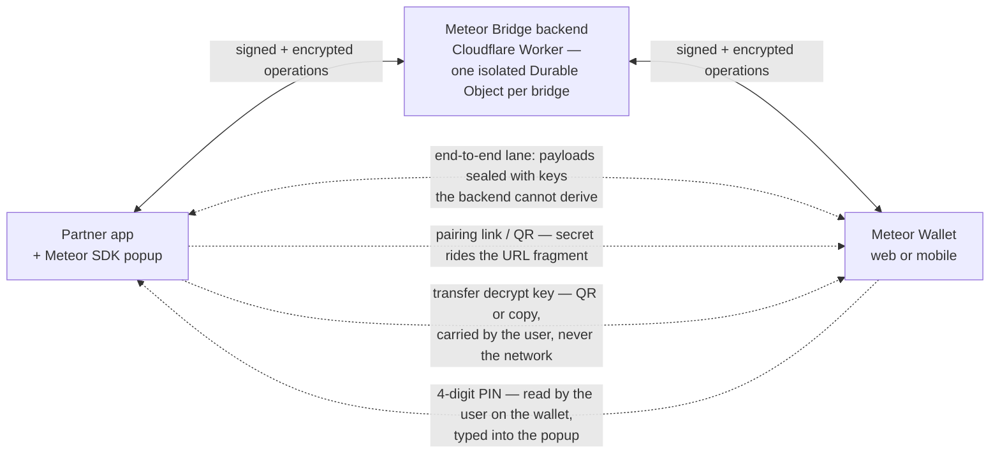
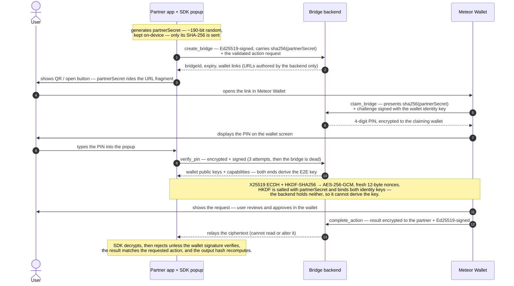
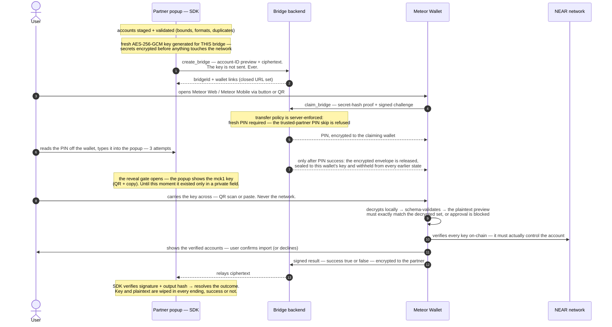
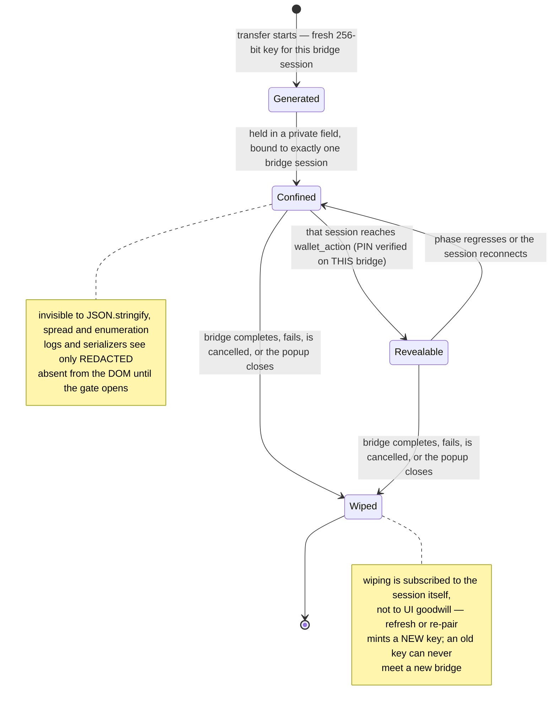

# Security — Meteor Connect & the Meteor Bridge

This document explains, in depth, how the Meteor Connect stack protects users and integrators:
the **partner SDK** (`@meteorwallet/sdk` — the popup your users see), the **Meteor Bridge
backend** (a Cloudflare Worker that relays between partner apps and Meteor Wallet), and the
**wallet clients** (Meteor Web and Meteor Mobile). It gives special attention to the
**account-transfer flow**, which moves the most sensitive material there is — account secrets —
and is engineered so that no server, including ours, can ever read them.

Everything below describes implemented, shipped behavior — not intentions. Where a protection has
a boundary, the boundary is stated explicitly in [Limits and non-goals](#limits-and-non-goals):
a security document you can trust is one that also tells you what it does *not* do.

**Scope.** The Meteor Connect bridge protocol (protocol version 1, `@meteorwallet/connect` /
`@meteorwallet/connect-shared` 0.9.0) and this SDK's popup flows, including account transfer.
Legacy Meteor V1 web/extension execution paths are outside this document.

---

## Design principles

1. **The relay is not trusted with secrets.** The backend coordinates; it cannot decrypt results,
   cannot derive the partner↔wallet encryption key, and never possesses account secrets or the
   transfer decrypt key in any form.
2. **Signatures, not origins.** Every state-changing backend operation must carry a valid Ed25519
   signature from the party entitled to make it. Authorization never rests on CORS, origins, or
   knowing an identifier.
3. **A human in the loop for pairing.** Connecting a wallet requires information that only someone
   physically using both ends can move: a PIN read off the wallet screen, and — for transfers — a
   decrypt key carried by hand from popup to wallet.
4. **Fail closed, loudly.** Unknown sensitive actions get the strictest policy. Verification
   failures throw typed errors (`mobile_bridge_wallet_signature_invalid`,
   `mobile_bridge_output_hash_mismatch`, …) — there are no silent fallbacks or downgraded retries.
5. **Least privilege at every surface.** The backend exposes no state-dump, polling, or admin
   endpoints; responses are hand-picked projections. Knowing a `bridgeId` grants nothing.
6. **Defense in depth.** Application-layer encryption sits inside channel encryption; schema
   validation sits behind size caps; CI lints enforce key confinement structurally.

---

## The moving parts

Three channels exist, and they deliberately have different owners:

- **The relay channel** (solid): partner ↔ backend ↔ wallet. Encrypted transport, per-operation
  Ed25519 signatures, server-side state machine. The backend sees coordination data here.
- **The end-to-end lane** (through the relay): payloads encrypted partner↔wallet with keys the
  backend cannot derive. Action results always travel this way; sensitive action requests get an
  additional wallet-encrypted envelope.
- **The human channel**: the pairing PIN and the transfer decrypt key move through the person
  doing the transfer — the one channel no network attacker or relay can sit on.

### Who can see what

| Data | Partner app | Backend | Meteor Wallet |
| --- | :-: | :-: | :-: |
| `partnerSecret` (pairing secret) | ✅ generates | ❌ SHA-256 hash only | ✅ from URL fragment |
| End-to-end AES key | ✅ derives | ❌ cannot derive | ✅ derives |
| Pairing PIN | user types it in | ✅ generates + verifies | ✅ displays |
| Action request (e.g. transaction to sign) | ✅ | ✅ validated + stored | ✅ after claim / PIN |
| **Account secrets (transfer)** | ✅ until wiped | ❌ ciphertext only | ✅ after user carries the key |
| **Transfer decrypt key (`mck1.…`)** | ✅ confined, until wiped | ❌ never, in any form | ✅ from the user only |
| Account IDs being transferred | ✅ | ✅ (preview list) | ✅ |
| Action result / signed outcome | ✅ verifies | ❌ opaque ciphertext | ✅ produces + signs |

---

## Pairing and regular wallet actions

Every action — sign-in, message signing, transactions — runs over a **single-use, short-lived
bridge** (production default: 5-minute expiry, enforced server-side at every operation and
reclaimed by an expiry alarm).

### Bridge identity and idempotency

- Each bridge lives in its **own Durable Object** — isolated state, no shared tables to confuse.
- The bridge is addressed by a hash of the partner's identity key and a `partnerRequestId` that
  must be **unguessable** (the SDK uses `crypto.randomUUID()`, ~122 bits, fresh per session).
- Creation is idempotent: replaying the same request returns the same bridge; replaying the same
  id with *different* content is rejected (`idempotency_conflict`) — a request cannot be quietly
  swapped after the fact.

### The link secret

- `partnerSecret` is generated **client-side** in the SDK (~190 bits of entropy). The backend
  receives only its SHA-256.
- It travels to the wallet in the **URL fragment** (`#partnerSecret=…`) — fragments are never sent
  in HTTP requests, so the secret stays out of server access logs and referrer headers. The wallet
  reads it and immediately strips it from the address bar.
- It does two jobs: the wallet must present its hash to claim the bridge (proof it received the
  link out-of-band), and it salts the key derivation — so **even a party that fully compromised
  the relay could not compute the session key**.

### The PIN

- Generated **server-side per claim**: 4 decimal digits from `crypto.getRandomValues` with
  unbiased rejection sampling, delivered encrypted to the claiming wallet only.
- Verified server-side with a **constant-time comparison**. The attempt counter is durably
  incremented *before* each comparison, so racing requests cannot gain extra tries.
- **Three attempts, then the bridge is terminally failed** — there is no unlock, retry-later, or
  reset path. Combined with the short expiry, brute-forcing the PIN space is not viable.
- The PIN is a *pairing* proof — evidence the same human controls both ends. Confidentiality never
  rests on it; the encryption keys are derived from `partnerSecret`, which the backend lacks.
- Re-connections between an already-paired wallet and partner may skip the PIN for ordinary
  actions. **Sensitive actions (account transfer) always force a fresh PIN** — the policy is
  encoded server-side and cannot be relaxed by the partner.

### Signed results — and what the SDK refuses to accept

The wallet signs the **plaintext result** with its Ed25519 identity key — a key registered once
and thereafter always sourced from the backend's wallet registry, never from claim input — then
encrypts result + signature to the partner. Before any result reaches your code, this SDK
enforces three independent checks and throws a typed error on each failure:

1. the wallet signature must verify (`mobile_bridge_wallet_signature_invalid`),
2. the result must answer exactly the requested action domain + id
   (`mobile_bridge_action_result_mismatch`),
3. the result's output hash must recompute from its contents
   (`mobile_bridge_output_hash_mismatch`).

Replay is structurally dead: every bridge derives a unique E2E key, so a ciphertext from one
bridge cannot even be decrypted on another; within a bridge, a repeated `complete_action` is
authenticated and then ignored in favor of the stored result.

### Wallet links the partner cannot forge

The URLs and deep links offered to the user ("Open Meteor Web", QR codes) are **authored by the
backend from a closed set** — an exhaustive switch over known Meteor app IDs
(`wallet.meteorwallet.app`, `meteorwallet://`, …). Partners select an app id from an enum; they
never supply a URL. On top of that, the SDK's opener refuses anything that is not exactly the
backend-issued link (plus its own fragment) for web targets, and pins the custom URL scheme for
mobile targets. A malicious page embedding the SDK cannot redirect the "open wallet" action to a
look-alike site.

---

## Account transfer, end to end

Account transfer moves **wallet secrets** (mnemonics / private keys) from a partner wallet into
Meteor. The design goal is blunt: **the network, the backend, and any observer of either must
never be sufficient to reconstruct a secret — even in combination.** Only the encrypted payload
travels the network; the key that opens it travels through the user's hands.

### Layer 1 — encryption before transport

When the transfer popup opens a bridge, the SDK:

- generates a **fresh 256-bit AES-GCM key** for that bridge session — refreshing, retrying, or
  re-pairing generates a *new* key and re-encrypts from the staged source; an old key never meets
  a new bridge;
- encrypts the full account set (IDs, networks, secrets, derivation paths) into a single
  authenticated ciphertext with a fresh 12-byte nonce;
- sends **only** the ciphertext plus a plaintext preview of `blockchain / network / accountId`
  (built by explicit field allowlisting — secrets cannot ride along by object spread).

The key is encoded as `mck1.<43 base64url chars>.<6-char checksum>` — the checksum catches typos
and truncation on manual entry (it is an integrity aid, not a MAC; tamper-resistance comes from
AES-GCM authentication).

**Honest accounting:** the backend stores the transfer *request* like any other action request —
which for transfers means the account-ID preview in plaintext and the secret payload as
ciphertext. So the backend learns *which* accounts are being moved (needed for the wallet's
review screen), and can never learn their secrets.

### Layer 2 — a stricter server-side policy for sensitive actions

`transfer_accounts` is registered on the backend with a hardened delivery policy:

- **Fresh PIN always** — the returning-partner fast path is refused for this action.
- **Post-PIN encrypted delivery**: the payload is sealed to the claiming wallet's key
  (X25519 + HKDF → AES-256-GCM) and exposed **only after** PIN verification, from a state that is
  cleared again on completion, failure, cancellation, and expiry. It never appears in claim
  responses, and even another authenticated socket on the same bridge could only observe
  ciphertext it cannot decrypt.
- **Unknown first-party actions inherit this strictest policy automatically** (fail closed) —
  a future sensitive action cannot accidentally launch with the lenient default.
- Server-side policy is authoritative: partner-supplied requirements can only *add* strictness.

### Layer 3 — the human carries the key

The `mck1.` key crosses from popup to wallet exclusively via the user — QR scan or copy-paste —
and only after the PIN has proven that the same person controls both ends. This is the load-bearing
property of the whole design: **an attacker who owned the entire relay infrastructure would hold
ciphertext and no key; an attacker who intercepted the pairing link would still face the PIN gate
and would still never see the key, which only ever renders on the sender's screen.**

### Layer 4 — the wallet verifies before it trusts

Receiving ciphertext and a key is not enough to import anything. Meteor Wallet:

1. decrypts **locally** and schema-validates the payload (bounds, formats, version);
2. compares the plaintext preview against the authenticated decrypted set — count and content —
   and **blocks approval on any mismatch** (a relay that pads or edits the preview achieves
   nothing);
3. **verifies every derived key on-chain**: the key must genuinely control the claimed account —
   fabricated or mismatched entries are rejected;
4. shows the verified set for explicit user confirmation, skipping accounts already imported;
5. returns a **signed** result either way — a decline is a first-class, signed outcome, not a
   timeout.

The partner SDK then maps that signed result into a typed outcome
(`imported` / `declined` / `cancelled` / `expired` / `failed`) — and by default the partner's
staged accounts are **kept**, so nothing is silently removed from the user's current wallet.

### Validation bounds (enforced by shared schemas on every side)

| Bound | Value |
| --- | --- |
| Accounts per transfer | 1 – 50 |
| Secrets per account | 1 – 10 |
| Account ID | 2 – 64 chars, `a-z 0-9 . _ -` only (blocks homoglyph/bidi spoofing) |
| Mnemonics | exactly 12 or 24 words |
| Ciphertext | hard length cap (≈256 KiB plaintext) |
| Any action request | 400,000-char canonical-JSON cap, applied before any policy branch |

---

## Key confinement inside the SDK

The transfer key is the crown jewel, so its handling is structural, not conventional:

Concretely:

- The key lives in **ECMAScript `#private` fields** inside a dedicated handle — unreachable via
  property access, spread, `Object.keys`, or `JSON.stringify`; `toString`/`toJSON` return
  `"[REDACTED]"`.
- The handle is **bound one-shot to a single bridge session instance**. Its reveal method returns
  the key **only** when asked by that exact session, **only** while the session's authoritative
  phase is `wallet_action`, and **only** if unwiped — checked on every render, so a phase
  regression re-hides the key.
- Wiping is **event-driven from the session**: every terminal phase clears the key material and
  the decrypted staging snapshot, including thrown-error paths (`finally`-guaranteed).
- The reveal card renders the key and QR **conditionally** — before the gate opens there is
  nothing in the DOM to scrape; closing a committed transfer requires an explicit confirmation.
- The sensitive source is attached to actions via a module-private `WeakMap` — it is not a
  property of the action object and is unreachable from the public API.
- **CI enforces this**: a key-confinement lint (run in `build` and `test`, in this repo and in the
  protocol repo) pins the exact allowlist of files permitted to touch raw key material and fails
  the build on any new reference, log statement, or storage call involving it.
- A **post-execute guard** keeps the transfer domain fully separated from wallet-connection
  state — a transfer can never mutate, or be routed through, your users' signed-in accounts.

---

## Backend hardening

- **One Durable Object per bridge** — no cross-bridge state, per-bridge expiry alarms that delete
  bridge state on expiry.
- **No read-everything endpoints.** State-dump, polling, and admin RPCs were removed; the
  production router 404s everything except the action API, and dev/test routes are compiled out
  behind a fail-closed stage flag. What each party can observe is a hand-written projection —
  claim responses structurally exclude the PIN and the sealed envelope (asserted by tests that
  deep-walk the wire format).
- **Idempotency with binding hashes** — replays must match the original request bit-for-bit
  (canonical JSON, code-unit key ordering) or be rejected.
- **Failed authentication mutates nothing** — an unauthenticated caller cannot burn someone
  else's live bridge by spamming bad signatures.
- **Input hygiene at the edge**: closed enums for app IDs; partner metadata sanitized before it
  can reach an OS notification (length caps, control/bidi/ZWJ character rejection, `https://`-only
  icon URLs); validated-schema output is what gets persisted — unknown fields are stripped, and
  size caps apply *before* any policy branch so they cannot be dodged by domain relabeling.
- **Prototype-pollution-safe policy lookup** — action policies resolve through `Map`s with
  structural well-formedness guards, not object indexing.
- **Capability negotiation that fails safe**: the backend re-unions required wallet capabilities
  from server-side policy at creation, claim, and push — a stale stored list can never waive a
  newly mandatory capability. An under-capable wallet gets an explicit
  `wallet_update_required` (HTTP 426) with the required version, and the bridge fails rather than
  degrading. Transfer support (`transfer_accounts_v1`) is opt-in per wallet app — never implied.
- **Push privacy**: push tokens are stored per-wallet behind signature-gated writes; push payload
  secrets are sealed to the wallet's key; wallet identifiers never leave the backend — partners
  address wallets only by public-key handle. Push failure degrades to QR, never to an error state
  that leaks.
- **Logging hygiene as a review rule**: pairing-path logs record status *names*, not status
  objects (which would embed the PIN); envelope plaintext and key material are never logged.
- **Volumetric abuse** is filtered at the Cloudflare edge in front of the Worker; at the protocol
  layer, the PIN lockout, short TTLs, size caps, and signature requirements bound what any
  unauthenticated caller can do.

## Wallet-side protections

- **The wallet's backend is pinned in production builds.** Development builds accept a
  `mcBackend` override for local testing; production wallets ignore link-supplied backends
  entirely — a link can never point a real wallet at an attacker's relay.
- The pairing link's secret fragment is read once and **immediately stripped from the URL**.
- The wallet advertises its protocol version + capabilities **inside the signed claim challenge**
  — they cannot be tampered with in transit.
- For transfers: local-only decryption, preview-mismatch approval blocking, per-account on-chain
  key verification, already-imported skipping, and signed decline — as detailed above.

---

## Limits and non-goals

Stated plainly, because a reader deciding whether to trust this stack deserves the boundary map:

- **A compromised partner page is out of scope.** If your dapp/wallet is XSS'd or ships malicious
  code, secrets can be captured *before* they enter the SDK (at staging time). The SDK's
  confinement protects key material from exfiltration-after-the-fact and from other libraries on
  the page reaching into it — it cannot retroactively secure an already-hostile input path. Serve
  your app over HTTPS with a strict CSP, and stage secrets as close to `prompt()` as possible.
- **Account identifiers are visible to the backend** in a transfer (they power the wallet's
  review screen). Secrets are not, ever. If the set of account IDs is itself sensitive for your
  users, factor that in.
- **The pairing PIN is an anti-phishing/pairing control, not an encryption secret.** The backend
  generates and verifies it. Confidentiality rests on `partnerSecret` and the E2E key derivation,
  which the backend cannot perform.
- **The user's own device and judgment are trust anchors.** Malware on the user's machine, or a
  user who photographs the reveal QR for a stranger, defeats any protocol. The design minimizes
  the window (single bridge, minutes-long TTL, wipe-on-terminal) but cannot eliminate it.
- **Persisted staging is your call.** `persistStagedAccounts` stores staged secrets
  plaintext-at-rest in your origin's storage for dev convenience. It defaults to off; leave it
  off in production.

## Integrator checklist

- Serve your integration over **HTTPS** with a strict **Content-Security-Policy**.
- **Don't cache what you don't need**: stage secrets right before `prompt()`, and leave
  `persistStagedAccounts` off in production.
- **Trust the outcome object, not side effects**: only `{ status: "imported" }` (backed by the
  wallet's verified signature) means success. Treat every thrown error as "not transferred".
- Keep the SDK **updated** — protocol-level hardening ships as minor versions.
- Never proxy, log, or persist the bridge link: the fragment carries the pairing secret.
- If you render your own transfer UI copy, never ask users to send the reveal key through chat,
  email, or support channels — it is meant for their own wallet screen, in the moment, only.

## Continuous verification

- **Key-confinement lints run in CI on every build and test run**, in this repo and the protocol
  repo — the set of files allowed to touch raw key material is pinned; new references fail the
  build.
- The test suites include **adversarial canaries**: tampered results must be rejected, transfer
  results must never resolve a wallet connection, serialization of key handles must redact,
  wire-format walks assert the PIN/envelope never appear in claim responses, and outcome mapping
  is exercised for every terminal path.
- The full cross-app flow — partner popup → bridge → wallet claim → PIN → envelope → key reveal →
  wallet-side decrypt → on-chain rejection of an invalid account → signed decline — is exercised
  end-to-end against a real backend and real wallet frontend.

## Reporting a vulnerability

We take reports seriously and appreciate coordinated disclosure.

- Please report privately — do **not** open a public issue with exploit details.
- Reach the Meteor team through <https://meteorwallet.app>, or use GitHub's private security
  advisory ("Report a vulnerability") on this repository if enabled.
- Include reproduction steps and the affected package versions. We'll acknowledge, keep you
  informed through the fix, and credit you if you'd like.
